# Final Project Mobile Programming C | MoTix Kelompok 10

| Name           | NRP        | Class     |
| ---            | ---        | ----------|
| Yosua Hares | 5025221270 | Pemrograman Perangkat Bergerak (C) |
| Ahmad Fadhilah Mappisara | 5025221195 | Pemrograman Perangkat Bergerak (C) |
| Muhammad Alfan Mahdi | 5025221275 | Pemrograman Perangkat Bergerak (C) |

# Description App
Aplikasi mobile untuk pembelian tiket film. Pengguna dapat menjelajahi detail film lengkap dengan sinopsis hingga jadwal. Fitur beli tiket memudahkan pemesanan kursi. Terdapat juga review pengguna serta watchlist untuk menyimpan film favorit dan mengatur rencana menonton.

# API
- The Movie Database: https://api.themoviedb.org/3

# Use Case Diagram
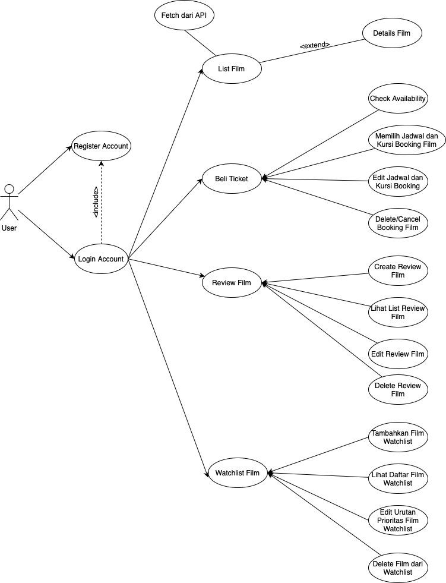

# Activity Diagram
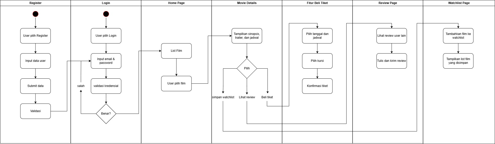

# Arsitektur Sistem
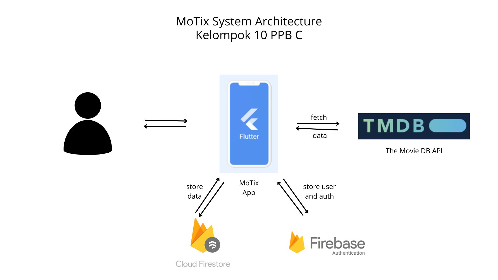

# Fitur dan PIC
| Fitur                | PIC    |
| ---                  | ---    |
| Register             | Hares  |
| Login                | Hares  |
| Home Page            | Fadhil |
| Movie Details        | Alfan  |
| CRUD Beli Tiket      | Hares  |
| CRUD Review Movie    | Fadhil |
| CRUD Watchlist Movie | Alfan  |

# Register (Hares)
Fitur register memungkinkan pengguna baru untuk membuat akun dengan memasukkan nama, email, dan password. Setelah berhasil, pengguna akan diarahkan ke halaman login.
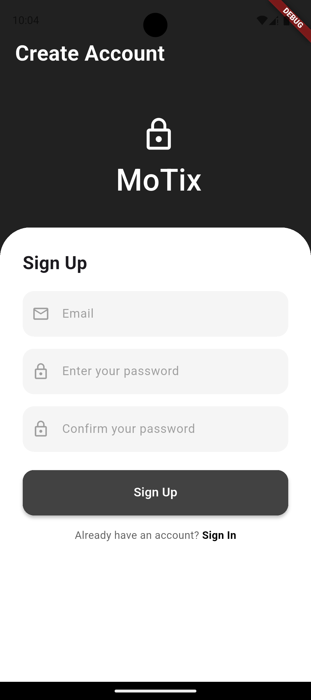

# Login (Hares)
Fitur login memungkinkan pengguna untuk masuk ke akun mereka dengan memasukkan email dan password. Setelah berhasil, pengguna akan diarahkan ke halaman utama aplikasi.
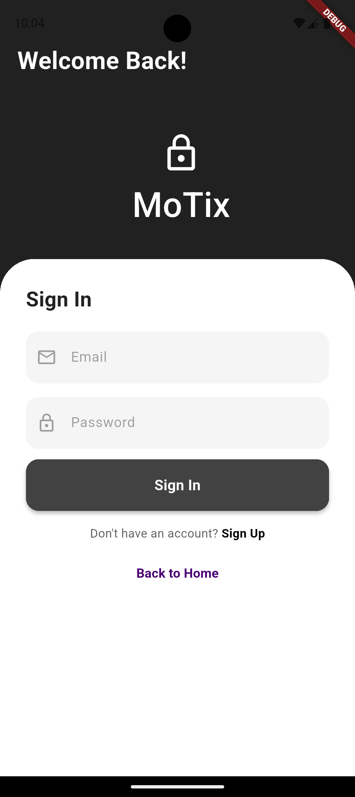

# Home Page (Fadhil)
Fitur home page menampilkan daftar film terbaru dengan poster, judul, dan rating. Pengguna dapat memilih film untuk melihat detail lebih lanjut.
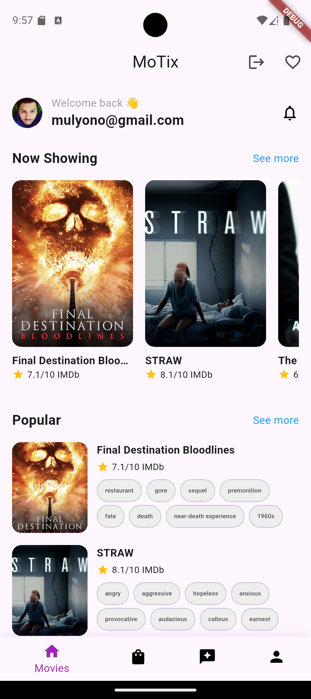
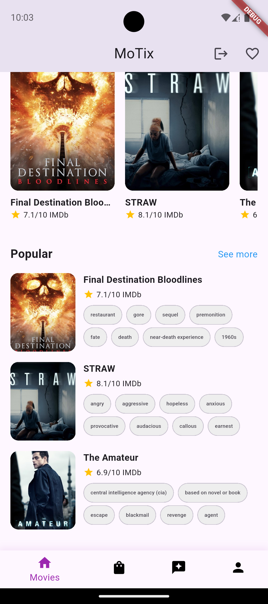
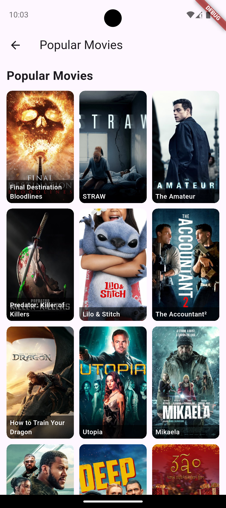

# Movie Details (Alfan)
Fitur movie details menampilkan informasi lengkap tentang film, termasuk sinopsis, jadwal tayang, dan rating. Pengguna dapat melihat review dari pengguna lain dan menambahkan film ke watchlist.
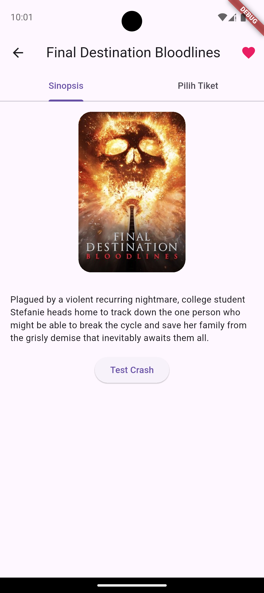
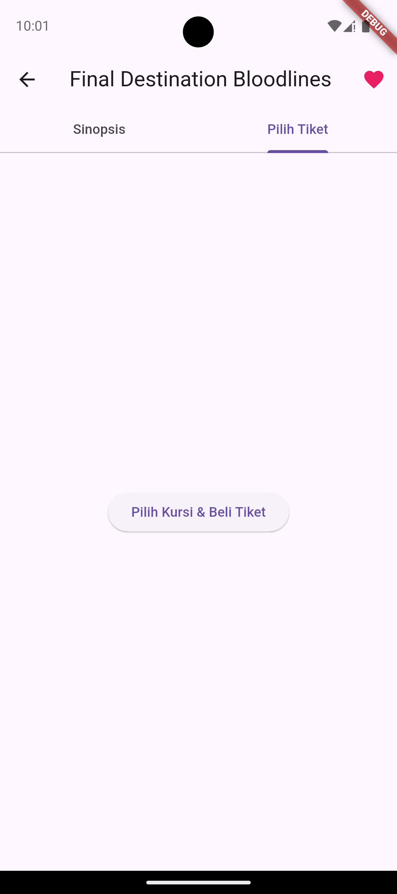

# CRUD Beli Tiket (Hares)
Fitur beli tiket memungkinkan pengguna untuk memilih film, jadwal, dan kursi. Setelah memilih, pengguna dapat melakukan pembayaran dan mendapatkan tiket digital.
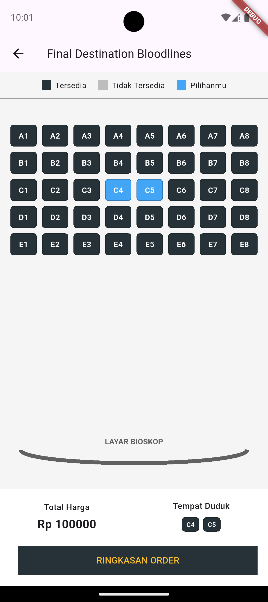

# CRUD Review Movie (Fadhil)
Fitur review movie memungkinkan pengguna untuk menulis, mengedit, dan menghapus review tentang film yang telah ditonton. Review dapat membantu pengguna lain dalam memilih film.
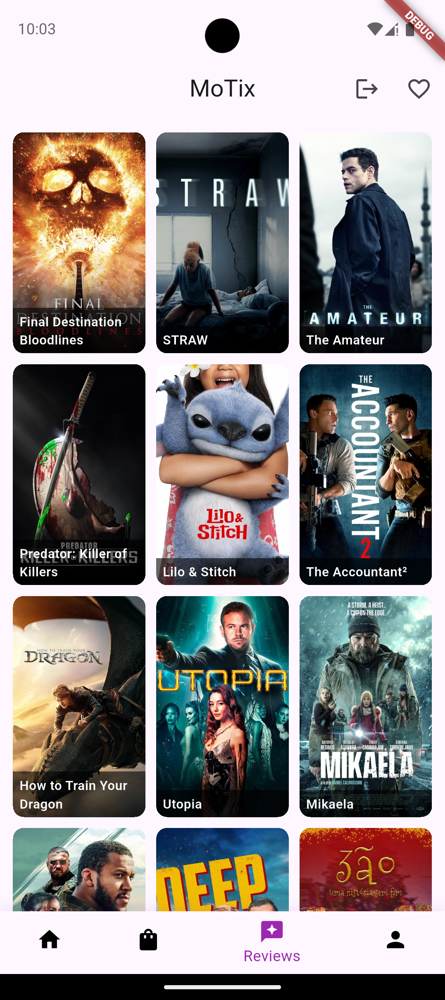
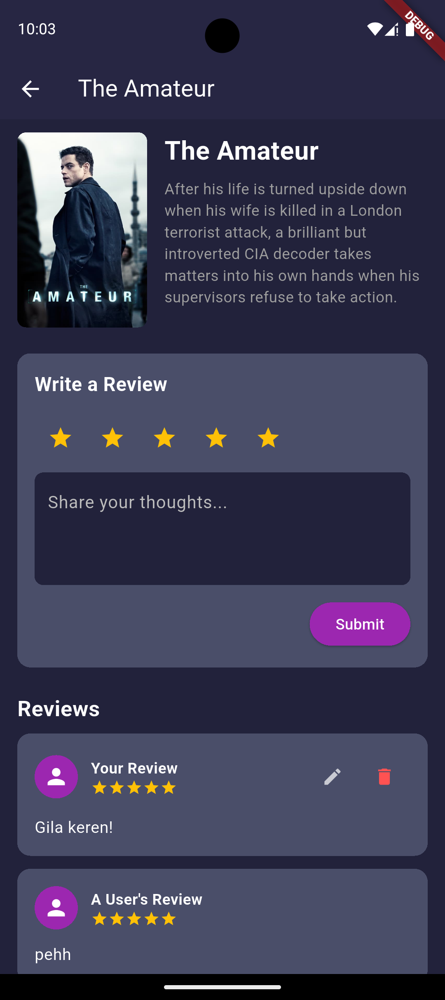

# CRUD Watchlist Movie (Alfan)
Fitur watchlist movie memungkinkan pengguna untuk menambahkan film ke daftar tonton mereka. Pengguna dapat mengelola daftar ini dengan menambahkan atau menghapus film sesuai keinginan.
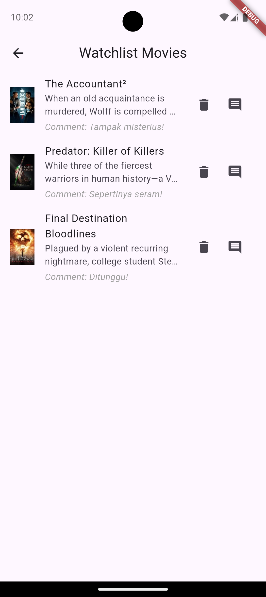